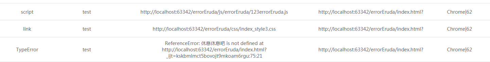

## errorEruda
1kb(gzip)代码搞定开发调试发布，错误监控上报，用户问题定位。

- 支持错误监控和上报
- 支持 Eruda错误展示
- 支持开发url拉起Eruda
- 支持img[src]，script[src]，link[href]请求链接错误监控
-  支持函数错误捕获
-  支持XHR请求监控
-  支持错误浏览器版本号上传

## 安装

    npm i errorEruda -save
注意：监控请求链接需要在最头部申明

     import  errorEruda from 'errorEruda/errorEruda'
## 使用方法

     errorEruda.config({
            jsUrl: '//cdn.jsdelivr.net/eruda/1.2.2/eruda.min.js',//eruda地址
            repUrl: "http://127.0.0.1:3000/",//错误上报地址
            repMsg: 'test',//错误上报msg前缀，一般用于标识业务类型
            entry: "#app"
        })`
eruda使用cdn,当然也支持下载到本地使用

     jsUrl: '/eruda/1.2.2/eruda.min.js',//eruda地址
传输参数：
error：错误信息
repMsg：收集系统标识
browser：浏览器版本号
type：错误类型（script，link，img，http（XHR请求），TypeError）
httpState：状态码（XHR独有）

## url启动errorEruda
url里带上errorEruda=show 就能显示Console面板。如:

        http://jqvue.com/demo/errorEruda/index.html?errorEruda=show`
